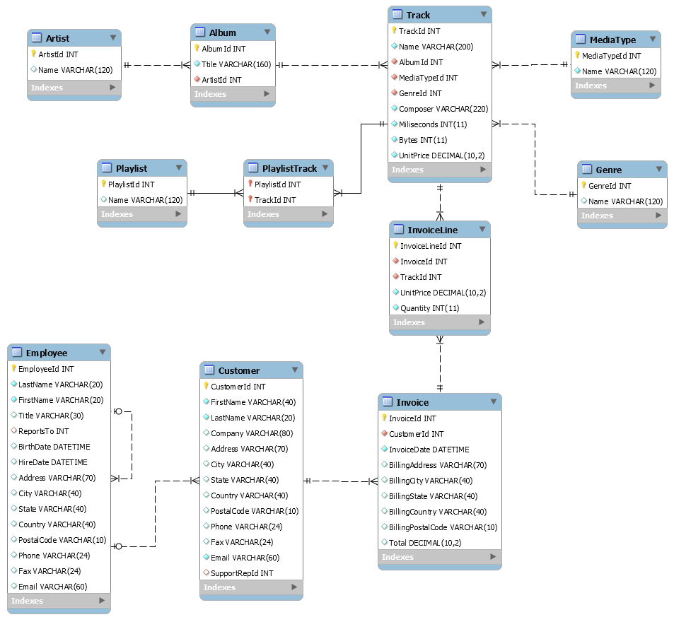
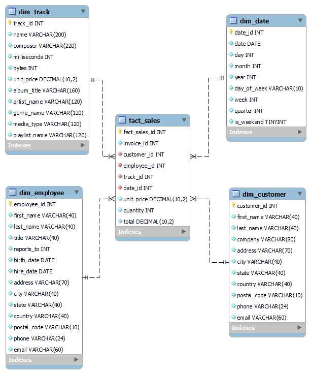

# MikaSnowflake
ETL Proces pre Chinook Databázu

Tento projekt popisuje ETL (Extract, Transform, Load) proces pre spracovanie údajov zo známeho hudobného datasetu Chinook, ktorý obsahuje informácie o predajoch, zákazníkoch, skladbách, albumoch a ďalších aspektoch hudobného distribučného systému.
Účel projektu:

Cieľom tohto projektu je extrahovať údaje zo súborov CSV, transformovať ich do štruktúrovaného formátu a načítať ich do Snowflake databázy, kde sa vytvoria dimenzionálne a faktové tabuľky. Tieto tabuľky umožnia generovať prehľady a analytické vizualizácie, ktoré poskytujú cenné informácie o tržbách, zákazníkoch, zamestnancoch a ďalších metrikách súvisiacich s predajmi hudby.
Stručný popis ERD (Entity Relationship Diagram):

Databázová schéma Chinook je navrhnutá na analýzu predajov hudobného obsahu. Hlavné entity zahŕňajú:

    Zákazníci (Customers): Informácie o zákazníkoch, ako sú meno, adresa, kontaktné údaje a pod.
    Zamestnanci (Employees): Informácie o zamestnancoch, ktorí spravujú predaje.
    Produkty (Tracks, Albums, Genres, MediaTypes): Údaje o skladbách, albumoch, žánroch a médiách, cez ktoré sa predávajú skladby.
    Predaje (Invoices a InvoiceLines): Transakčné údaje o nákupoch, ktoré zákazníci uskutočnili.
    Dátumy (Date): Kľúčová dimenzia pre analýzu predajov podľa časových období (mesiace, roky, kvartály, atď.).

ERD Diagram Zdrojových Dát:

  
   
  <em>Obrázok 1 Entitno-relačná schéma Chinook</em>

Tento diagram zobrazuje kľúčové tabulky a ich vzťahy, ktoré sú základom pre analytické procesy v rámci tohto projektu.

STAR Diagram:

  
   
  <em>Obrázok 1 Star schéma Chinok</em>

Tento diagram zobrazuje dimenzionálne tabulky a ich vzťahy s Tabuľkov faktov ktorá umožnuje lepšiu prístupnosť a vizualizáciu dát.

ETL Proces

Pred spustením ETL procesu sa uistite, že sú splnené nasledujúce predpoklady:

    Nastavenie Snowflake Warehousu: Musíte mať prístup k Snowflake inštancii s potrebnými oprávneniami na vytváranie a správu warehousov, databáz a schém.

    Súbory v Staging: Všetky CSV súbory musia byť nahrané do staging oblasti (@chinook_stage). Súbory musia byť vo formáte CSV s hlavičkami ktoré sa nachadzajú v tomto github repozitári.

    Databáza a Schéma: Databáza LEMMING_CHINOOK_DB a schéma public by mali byť už vytvorené.

Prehľad Súborov

Nasledujúce sekcie popisujú komponenty ETL procesu, vrátane vytvárania staging tabuliek, transformačných krokov a načítania údajov do dimenzionálnych a faktových tabuliek.
Nastavenie Warehousu a Databázy

Skript najprv nastaví Snowflake warehouse a zabezpečí použitie správnej databázy a schémy:
    
    CREATE WAREHOUSE IF NOT EXISTS LEMMING_WH;
    USE WAREHOUSE LEMMING_WH;
    USE LEMMING_CHINOOK_DB;
    USE SCHEMA LEMMING_CHINOOK_DB.public;

Staging Tabuľky

Skript vytvára staging tabulky na uchovávanie surových údajov extrahovaných zo súborov CSV. Tieto tabulky sú:

    Artist_Staging
    Album_Staging
    Track_Staging
    Genre_Staging
    MediaType_Staging
    Customer_Staging
    Invoice_Staging
    InvoiceLine_Staging
    Employee_Staging

Príklad:

    CREATE TABLE Artist_Staging (
        ArtistId INT PRIMARY KEY,
        Name VARCHAR(120)
    );

Kopírovanie Údajov do Staging Tabuliek

Údaje sú kopírované zo súborov CSV uložených v staging oblasti @chinook_stage do príslušných staging tabuliek. Súbory údajov by mali byť vo formáte CSV a prvý riadok by mal obsahovať hlavičky.

Príklad:

    COPY INTO Artist_Staging
    FROM @chinook_stage/Artist.csv
    FILE_FORMAT = (TYPE = 'CSV' FIELD_OPTIONALLY_ENCLOSED_BY = '"' SKIP_HEADER = 1);

Dimenzionálne Tabulky

Po načítaní surových údajov do staging tabuliek sa údaje transformujú a vkladajú do nasledujúcich dimenzionálnych tabuliek:

    Dim_Track
    Dim_Customer
    Dim_Employee
    Dim_Date

Tabuľka Dim_Track je príkladom transformácie údajov:

    CREATE OR REPLACE TABLE Dim_Track (
        TrackId INT PRIMARY KEY,
        Name VARCHAR(200),
        Composer VARCHAR(220),
        Milliseconds INT,
        Bytes INT,
        UnitPrice DECIMAL(10, 2),
        AlbumTitle VARCHAR(160),
        ArtistName VARCHAR(120),
        GenreName VARCHAR(120),
        MediaType VARCHAR(120)
    );

Transformačný krok pre vkladanie údajov do tabuľky Dim_Track vyzerá takto:
    
    INSERT INTO Dim_Track (TrackId, Name, Composer, Milliseconds, Bytes, UnitPrice, AlbumTitle, ArtistName, GenreName, MediaType)
    SELECT 
        t.TrackId,
        t.Name,
        t.Composer,
        t.Milliseconds,
        t.Bytes,
        t.UnitPrice,
        a.Title AS AlbumTitle,
        ar.Name AS ArtistName,
        g.Name AS GenreName,
        mt.Name AS MediaType
    FROM Track_Staging t
    JOIN Album_Staging a ON t.AlbumId = a.AlbumId
    JOIN Artist_Staging ar ON a.ArtistId = ar.ArtistId
    JOIN Genre_Staging g ON t.GenreId = g.GenreId
    JOIN MediaType_Staging mt ON t.MediaTypeId = mt.MediaTypeId;

Faktová Tabuľka

Skript napĺňa faktovú tabuľku Fact_Sales s transakčnými údajmi z tabuliek Invoice_Staging a InvoiceLine_Staging. Táto faktová tabuľka odkazuje na dimenzionálne tabuľky.

    CREATE OR REPLACE TABLE Fact_Sales (
        FactSalesId INT PRIMARY KEY,
        CustomerId INT,
        EmployeeId INT,
        TrackId INT,
        DateId INT,
        UnitPrice DECIMAL(10, 2),
        Quantity INT,
        Total DECIMAL(10, 2),
        FOREIGN KEY (CustomerId) REFERENCES Dim_Customer(CustomerId),
        FOREIGN KEY (EmployeeId) REFERENCES Dim_Employee(EmployeeId),
        FOREIGN KEY (TrackId) REFERENCES Dim_Track(TrackId),
        FOREIGN KEY (DateId) REFERENCES Dim_Date(DateId)
    );

Vkladanie údajov do tabuľky Fact_Sales:

    INSERT INTO Fact_Sales (FactSalesId, CustomerId, EmployeeId, TrackId, DateId, UnitPrice, Quantity, Total)
    SELECT 
        i.InvoiceId AS FactSalesId,
        i.CustomerId,
        c.SupportRepId AS EmployeeId,
        ts.TrackId,
        d.DateId,
        il.UnitPrice,
        il.Quantity,
        i.Total
    FROM Invoice_Staging i
    JOIN InvoiceLine_Staging il ON i.InvoiceId = il.InvoiceId
    JOIN Track_Staging ts ON il.TrackId = ts.TrackId
    JOIN Dim_Date d ON d.Dates = DATE(i.InvoiceDate)
    JOIN Customer_Staging c ON i.CustomerId = c.CustomerId;

Údržba

Na záver sa staging tabulky zmažú, aby sa udržal čistý environment:

    DROP TABLE IF EXISTS Artist_Staging;
    DROP TABLE IF EXISTS Album_Staging;
    DROP TABLE IF EXISTS Track_Staging;
    DROP TABLE IF EXISTS Genre_Staging;
    DROP TABLE IF EXISTS MediaType_Staging;
    DROP TABLE IF EXISTS Customer_Staging;
    DROP TABLE IF EXISTS Invoice_Staging;
    DROP TABLE IF EXISTS InvoiceLine_Staging;
    DROP TABLE IF EXISTS Employee_Staging;
    
Vizualizácie Dashboardu

Nasledujúce SQL dotazy sú navrhnuté pre vizualizácie, ktoré poskytujú užitočné prehľady o tržbách a výkonnosti zamestnancov:
Sales by Country

Zobrazí celkové tržby podľa krajiny:
    
    SELECT c.Country, SUM(f.Total) AS CountrySales
    FROM Fact_Sales f
    JOIN Dim_Customer c ON f.CustomerId = c.CustomerId
    GROUP BY c.Country
    ORDER BY CountrySales DESC;

Top 10 Customers by Revenue

Zobrazí top 10 zákazníkov podľa tržieb:

    SELECT 
        CONCAT(c.FirstName, ' ', c.LastName) AS FullName, 
        SUM(f.Total) AS TotalRevenue
    FROM Fact_Sales f
    JOIN Dim_Customer c ON f.CustomerId = c.CustomerId
    GROUP BY c.CustomerId, FullName
    ORDER BY TotalRevenue DESC
    LIMIT 10;

Sales Over Time by Employee

Zobrazí tržby za každý mesiac podľa zamestnanca:

    SELECT 
        CONCAT(d.Years, '-', LPAD(d.Months, 2, '0')) AS YearMonth,
        CONCAT(e.FirstName, ' ', e.LastName) AS Name,
        SUM(f.Total) AS EmployeeMonthlySales
    FROM Fact_Sales f
    JOIN Dim_Date d ON f.DateId = d.DateId
    JOIN Dim_Employee e ON f.EmployeeId = e.EmployeeId
    GROUP BY d.Years, d.Months, e.EmployeeId, Name
    ORDER BY d.Years, d.Months;

Sales by Genre

Zobrazí tržby podľa žánru:
    
    SELECT t.GenreName, SUM(f.Total) AS GenreSales
    FROM Fact_Sales f
    JOIN Dim_Track t ON f.TrackId = t.TrackId
    GROUP BY t.GenreName
    ORDER BY GenreSales DESC;

Sales by Months in Year

Zobrazí tržby podľa mesiacov v roku:
    
    SELECT 
        d.Years,
        CASE d.Months
            WHEN 1 THEN 'January'
            WHEN 2 THEN 'February'
            WHEN 3 THEN 'March'
            WHEN 4 THEN 'April'
            WHEN 5 THEN 'May'
            WHEN 6 THEN 'June'
            WHEN 7 THEN 'July'
            WHEN 8 THEN 'August'
            WHEN 9 THEN 'September'
            WHEN 10 THEN 'October'
            WHEN 11 THEN 'November'
            WHEN 12 THEN 'December'
        END AS MonthName,
        SUM(f.Quantity * f.UnitPrice) AS MonthlyRevenue
    FROM Fact_Sales f
    JOIN Dim_Date d ON f.DateId = d.DateId
    GROUP BY d.Years, d.Months
    ORDER BY d.Years, d.Months;
Tento README súbor poskytuje jasný a stručný prehľad o ETL procese a vizualizáciách dashboardu.

Autor:Andrej Mika
